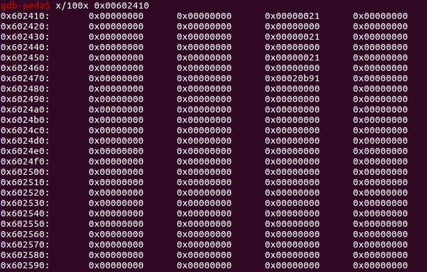
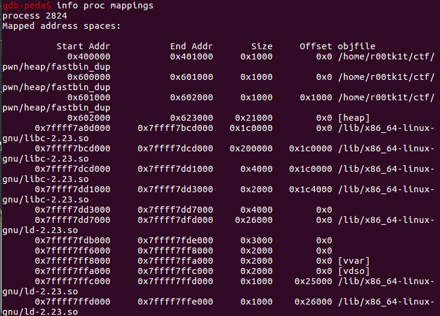
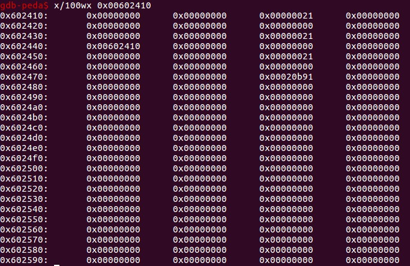
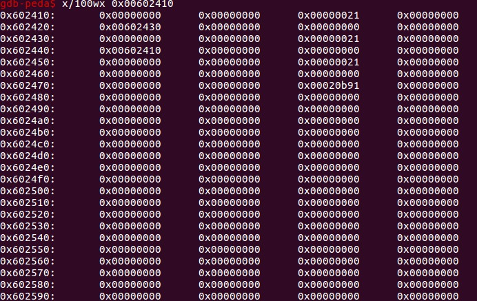
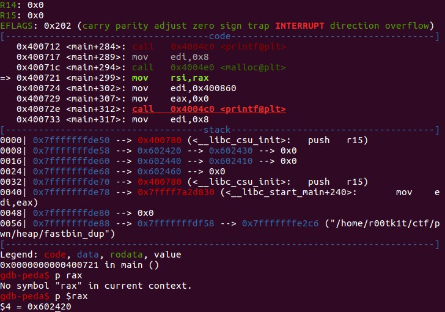
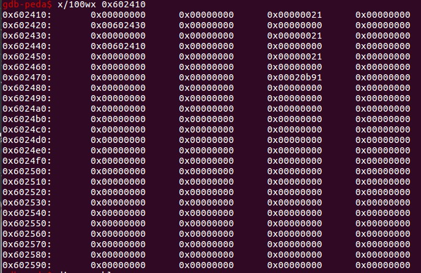
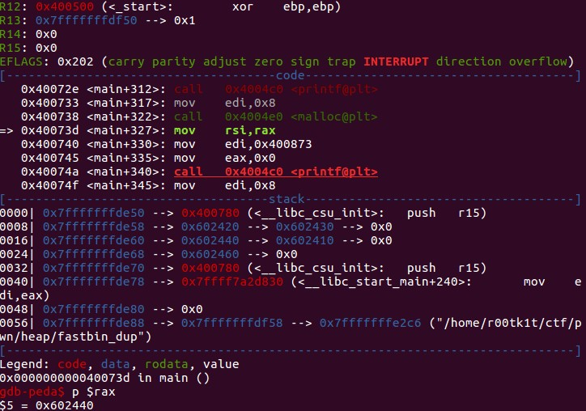
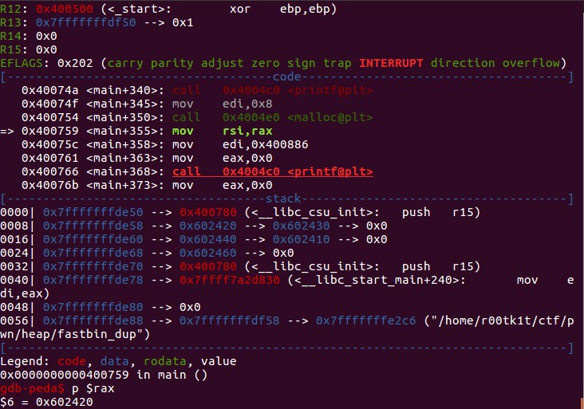
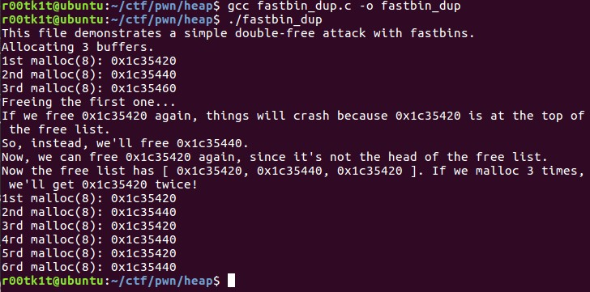

# fastbin_dup.log
simplify source code:
```
int main()
{
	int *a = malloc(8);
	int *b = malloc(8);
	int *c = malloc(8);

	printf("1st malloc(8): %p\n", a);
	printf("2nd malloc(8): %p\n", b);
	printf("3rd malloc(8): %p\n", c);

	free(a);
	free(b);
	free(a);

	printf("Now the free list has [ %p, %p, %p ]. If we malloc 3 times, we'll get %p twice!\n", a, b, a, a);
	printf("1st malloc(8): %p\n", malloc(8));
	printf("2nd malloc(8): %p\n", malloc(8));
	printf("3rd malloc(8): %p\n", malloc(8));
}
```
## Ubuntu x64 libc-2.23.so
malloc(8) =》max(32(preSize+curSize+fd+bd), (8 + 16(preSize+curSize(low3bits)) - 8(next chunk's preSize))align(16)) = 32

for three times:
0x00602410~0x0060242f chunk a
0x00602430~0x0060244f chunk b
0x00602450~0x0060246f chunk c
0x00602470~0x00622fff chunk top



查看区段信息，确定尽在掌握。


after free(a):


没有什么变化，chunk a被放入fastbin，fastbin原本为空，放入a后，fastbin的top元素为a，即fastbin->0x602410。
另一方面，由于fastbin是单链表，只有fd指针，a此时并不存在front元素，所以为NULL。
此外，由于fastbin的不合并特性，glibc不会把free掉的chunk其对应的next chunk中curSize的P使用位清0。

根据printf的提示，如果此时再次free(a)，会由于a是当前fastbin的top元素而落入glibc的检查失败，具体代码日后分析。

after free(b):


这个时候由于chunk b也会被放入fastbin，放置后的单链表指向关系应该是：fastbin->0x602430(b)->0x602410(a)，此时b为top元素，查看上图chunk b的内存，也可以发现fd成员变成了0x602410，也就是chunk a，符合预期。

> 注意，这个fastbin实际上是个链表头数组，这里正确的写法应该是fastbin[index]，我写成fastbin是为了易读。

再次free(a), 此为double free：


可以看到指针a指向的chunk a虽然此前已释放，但由于a并未置NULL，所以a指向的仍然是此前free掉的chunk a。double free(a)并没有导致free的出错（可以说是glibc的安全缺陷），且从效果上来看，单链表形成了一个环：
fastbin->0x602410(chunk a)->0x602430(chunk b)->0x602410(chunk a)->...。

此时，如果重新再malloc 3个同样大小的chunk，由于glibc的管理机制，会直接从fastbin的top摘。
第一次malloc：


由于malloc返回的是指向Alloc部分的指针，所以要对rax-0x10也就是0x602410刚好是chunk a。
由于没有对这块内存进行写操作，所以内存值依然如此：


但此时单链表关系变为：fastbin->0x602430(chunk b)->0x602410(chunk a)->...。注意，此时chunk a已经被分配过一次。

> 注意，此时的free chunk中fd成员已经变为alloc chunk中的data buffer，不再有意义。虽然对于本例来说，这个fd指针就是一个可控的好东西，比如我们可以任意修改这个chunk a中的fd（也就是data buffer[0]）指向一个我们可控的伪造的chunk上，当chunk a被二次malloc时，就可以为所欲为（此时的fd具备了真实的意义，而这个fd可能是faked）。

第二次malloc：


一切正常，堆空间内存依然没有什么变化。此时单链表为fastbin->0x602410(chunk a)->...。注意，此时chunk a已经分配过一次。

第三次malloc:


此时单链表为fastbin->0x602430(chunk b)->...。

> 再不改写data buffer时，这个环始终生效，fastbin永不为空。

我们可以修改程序，在不改写data buffer时，多次的malloc，看看输出如何：


double free如何利用？实际上上文中已经隐约提到。比如作者提供的另一个fastbin_dup_into_stack程序就是一个不错的例子。