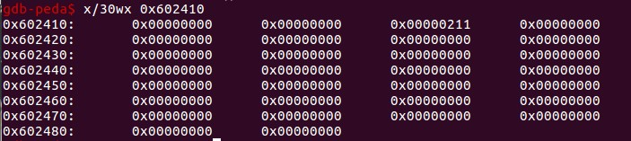
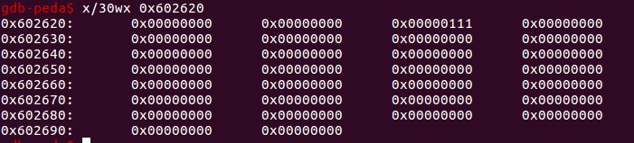
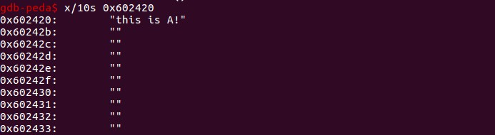
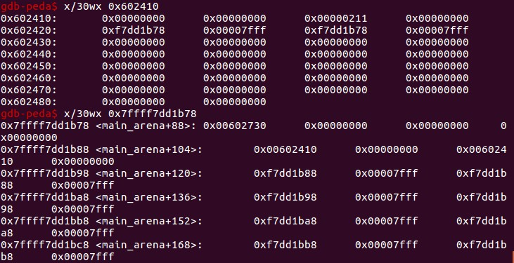
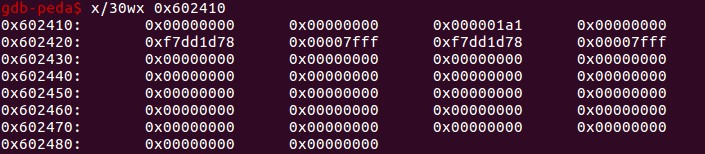
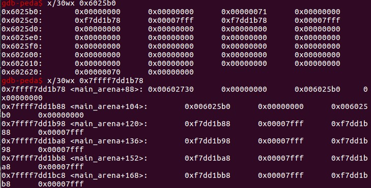

# first_fit.log

## source code
```cpp
int main()
{
	printf("This file doesn't demonstrate an attack, but shows the nature of glibc's allocator.\n");
	printf("glibc uses a first-fit algorithm to select a free chunk.\n");
	printf("If a chunk is free and large enough, malloc will select this chunk.\n");
	printf("This can be exploited in a use-after-free situation.\n");

	printf("Allocating 2 buffers. They can be large, don't have to be fastbin.\n");
	char* a = malloc(512);
	char* b = malloc(256);
	char* c;

	printf("1st malloc(512): %p\n", a);
	printf("2nd malloc(256): %p\n", b);
	printf("we could continue mallocing here...\n");
	printf("now let's put a string at a that we can read later \"this is A!\"\n");
	strcpy(a, "this is A!");
	printf("first allocation %p points to %s\n", a, a);

	printf("Freeing the first one...\n");
	free(a);

	printf("We don't need to free anything again. As long as we allocate less than 512, it will end up at %p\n", a);

	printf("So, let's allocate 400 bytes\n");
	c = malloc(400);
	printf("3rd malloc(400): %p\n", c);
	printf("And put a different string here, \"this is C!\"\n");
	strcpy(c, "this is C!");
	printf("3rd allocation %p points to %s\n", c, c);
	printf("first allocation %p points to %s\n", a, a);
	printf("If we reuse the first allocation, it now holds the data from the third allocation.");
}
```

## environment
Ubuntu x64 libc.so.23 gdb-peda

## trace
两次malloc后：
chunk a => 0x602410
大小0x210也就是528，根据(512+16-8)align(16)。


chunk b => 0x602620
大小0x110也就是272，根据(256+16-8)align(16)。


填充chunk a的alloc数据：


释放a，a会被链到unsorted bin中，此时的last remainder依然是NULL：


可以看到，0x7ffff7dd1b88对应unsorted bin，idx-1处是top chunk。这里fd和bk指针的值由于glibc的bin索引从1开始的设计问题，导致其真实指向的应该是idx+1处的bin。简单来说，对于x64，将指针值+0x10即可。下方也可以看到每个空的bin[idx]的fd和bk都指向了自身(也要+0x10)，unsorted bin,smallbin,largebin都是双向循环链表。

分配400bytes，作为chunk c：


(400+16-8)align(16)为416，分配过程中unsorted bin会被挂到应属的bin中（x64中[32-1024)的chunk为small bin）。因此，chunk c中原本的fd和bk指针域的值不再是指向unsorted bin的0x7fffffff1b78，而是0x7fffffff1d78。

此后，malloc进行分配，从large bin上找到这个"Smallest first，best fit"大小为528的最合适chunk进行切割，割了0x1a0大小（也就是416）给chunk c。剩下的部分做成大小为0x70的free chunk，挂到unsorted bin，并置last remainder标记。看看剩下的chunk:


果然unsorted bin的链上依然是一个元素，也就是切割剩下的chunk。而last remainder则指向了切割剩下的chunk。（如果此时再次分配一个小于该chunk大小的small chunk，那么malloc过程中理论上不必再次将unsorted bin解散到small or large bin上，再搜索。last remainder实际上就是针对malloc局部命中做的bin缓存。）

此时，由于a指针在free之后没有置NULL，malloc c后，a指针和c指针指向的alloc区实际上是同一处，在对chunk c进行填充字符串后，如果对a进行使用，那么会发现和c如出一辙。这也是UAF的源头所在。
